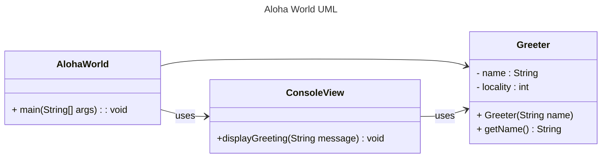

# Homework Aloha World Report

The following report contains questions you need to answer as part of your submission for the homework assignment. 

## Design Doc
Please link your UML design file here. See resources in the assignment on how to
link an image in markdown. You may also use [mermaid] class diagrams if you prefer, if so, include the mermaid code here.  You DO NOT have to include Greeting.java as part of the diagram, just the AlohaWorld application that includes: [AlohaWorld.java], [Greeter.java], and [ConsoleView.java].

### Program Flow
Write a short paragraph detailing the flow of the program in your own words. This is to help you understand / trace the code (and give you practice of something called a code walk that will be required in this course).
The program begins with AlohaWorld in main method.
It get the users name,and locality input.
Using this data,Greeter created,it is responsible for providing the greeting information.
It sent to the ConsoleView,prints the greeting to the ocnsole.
The program ends.

The program starts in AlohaWorld.main. First, it uses ConsoleView to ask the user for their name and locality. Then AlohaWorld creates a Greeter object using those inputs. The Greeter builds the greeting message (for example, using the name and locality), and the result is sent back to ConsoleView to print out. After printing the greeting, the program finishes and exits.

## Assignment Questions

1. List three additional java syntax items you didn't know when reading the code.  (make sure to use * for the list items, see example below, the backtick marks are used to write code inline with markdown)
   
   * (example) `final class`
*`trim()`
*`catch`
*`throw new`
2. For each syntax additional item listed above, explain what it does in your own words and then link a resource where you figured out what it does in the references section. 

    * (example) The `final` keyword when used on a class prevents the class from being subclassed. This means that the class cannot be extended by another class. This is useful when you want to prevent a class from being modified or extended[^1] . It is often the standard to do this when a class only contains static methods such as driver or utility classes. Math in Java is an example of a final class[^2] .
    *`trim()` is a method used on an object to remove any leading or trailing whitespace.
    * `catch` is used in cojunction with a try block to handle exceptions that occur during the execution of program.
    * `throw new`is used to trigger an exception.it can stop the process and signal excatly that went wrong.
3. What does `main` do in Java? 

    Go ahead and answer the question as a short paragraph / few sentences. Notice the indent, this is valid because it is a list item. (erase this line before writing.)

mian is a method usually at the startinig point for a Java program.It follows by the logic in the application in this method.

4. What does `toString()` do in Java? Why should any object class you create have a `toString()` method?

   
toString method helps to return a string that represent of an object.it shows meaningful data like name and locality.
toString()returns a string representation of an object. 

6. What is javadoc style commenting? What is it used for? 

   
Javadoc beigins with /** and ends with */. 
it is use for create HTML pages to make the code readable for yourself and your team.

7. Describe Test Driving Development (TDD) in your own words. 

TDD means writing tests before writing the actual code. First, the test fails. Then you write code until the test passes. After that, you can improve the code without breaking the test. This helps reduce errors and makes the program more reliable.
8. Go to the [Markdown Playground](MarkdownPlayground.md) and add at least 3 different markdown elements you learned about by reading the markdown resources listed in the document. Additionally you need to add a mermaid class diagram (of your choice does not have to follow the assignment. However, if you did use mermaid for the assignment, you can just copy that there). Add the elements into the markdown file, so that the formatting changes are reserved to that file. 

## Deeper Thinking Questions

These questions require deeper thinking of the topic. We don't expect 100% correct answers, but we encourage you to think deeply and come up with a reasonable answer. 

1. Why would we want to keep interaction with the client contained to ConsoleView?
   It is easy to modify if the class or settings (like Greeter class)will keep the same.

2. Right now, the application isn't very dynamic in that it can be difficult to add new languages and greetings without modifying the code every time. Just thinking programmatically,  how could you make the application more dynamic? You are free to reference Geeting.java and how that could be used in your design.
The greetings are hard coded,it is hard to add more new functions.we could move the greetung date out of the hard coded java files and into an external file.

> [!IMPORTANT]
>  After you upload the files to your github (ideally you have been committing throughout this progress / after you answer every question) - make sure to look at your completed assignment on github/in the browser! You can make sure images are showing up/formatting is correct, etc. The TAs will actually look at your assignment on github, so it is important that it is formatted correctly.

## References

[^1]: Final keyword in Java: 2024. https://www.geeksforgeeks.org/final-keyword-in-java/. Accessed: 2024-03-30. 

[^2]: Math (Java Platform SE 17). https://docs.oracle.com/en/java/javase/17/docs/api/java.base/java/lang/Math.html. Accessed: 2024-03-30.

<!-- This is a comment, below this link the links in the document are placed here to make ti easier to read. This is an optional style for markdown, and often as a student you will include the links inline. for example [mermaid](https://mermaid.js.org/intro/syntax-reference.html) -->
[mermaid]: https://mermaid.js.org/intro/syntax-reference.html
[AlohaWorld.java]: src/main/java/student/AlohaWorld.java
[Greeter.java]: src/main/java/student/Greeter.java
[ConsoleView.java]: src/main/java/student/ConsoleView.java
