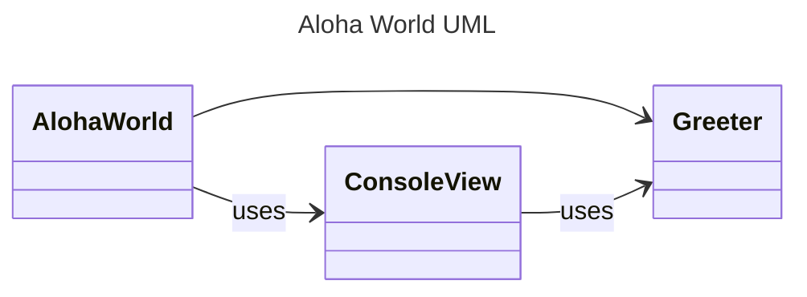

# Aloha World Homework Instructions

Aloha! This assignment is meant to give you an introduction to the java programming language and object oriented design. The assignment is to debug the provided java application, and then add a new java object from scratch giving you both the experience of a working java program, and writing a file from scratch. Overall, the goal is for you to learn the homework submission process, and get a feel for the java programming language.

## Table of Contents
- [Aloha World Homework Instructions](#aloha-world-homework-instructions)
  - [Table of Contents](#table-of-contents)
  - [Learning Objectives](#learning-objectives)
  - [Javadoc](#javadoc)
  - [Assumptions](#assumptions)
  - [Instructions](#instructions)
    - [Part 1: Getting the sample code into your IDE](#part-1-getting-the-sample-code-into-your-ide)
      - [Part 1.1: Updating the README.md](#part-11-updating-the-readmemd)
    - [Part 2: Design Documentation](#part-2-design-documentation)
    - [Part 3: Debugging the Aloha World Application](#part-3-debugging-the-aloha-world-application)
      - [Part 3.1: Building with Gradle](#part-31-building-with-gradle)
      - [Part 3.2: Debugging the Code using Tests](#part-32-debugging-the-code-using-tests)
      - [Running the application](#running-the-application)
    - [Part 4: Adding The Greeting Class](#part-4-adding-the-greeting-class)
    - [Part 5: Answering the Questions](#part-5-answering-the-questions)
  - [Submission](#submission)
  - [📝 Grading Rubric](#-grading-rubric)
    - [Submission Reminder 🚨](#submission-reminder-)
    - [Autograder Limitation](#autograder-limitation)


## Learning Objectives

* Learn how to debug a java application along with basic java syntax
* Learn how to write a single java class 
* Practice testing using JUnit tests
* Be able to answer some introductory questions about java syntax and object oriented design
* Write a UML diagram for a java application
* Learn about git and github 
* Learn how to use gradescope combined with github for homework submission
* Learn markdown syntax used for reports and README files for homework assignments
* Learn basic mermaid syntax used for drawing diagrams in markdown

An observant reader will notice that many of the learning objectives have very little to do with the code itself. This is intentional. The goal of this assignment is to get you comfortable with the homework submission process, and to get your "ecosystem" setup for this class. Just as importantly, this classes focuses heavily on industrial practices, and we want to get you comfortable with the tools you will be using in the industry. Github and Markdown are both tools heavily used in industry, so we will be using for all our assignments. 

## Javadoc


* [javadoc] - For this assignment we are providing the full javadoc, so you can get used to reading javadoc. Notice most of the java ecosystem uses this type of documentation
  that is actually derived from the comments. Future assignments we are unable to provide it, as having the javadoc essentially gives a lot of the design solution. 


## Assumptions

This homework assumes you have installed your favorite IDE (preferably IntelliJ) and installed the recommended plugins or extension as listed on the resource page on Canvas. Additionally, you will need to make sure gradle and java are installed. You can confirm they are installed by going to the command line and typing `java -version` and `gradle -version`. If you get a version number, you are good to go. If you get an error, you will need to install them or check your environment variables.

You should also have downloaded the sample code, which if you're seeing this you probably have, and also created a Github repository to store your assignments in. As a reminder, you need a Github.com account! If you don't already have one, you should be able to use one tied to your Northeastern University email account.


## Instructions

This assignment is broken up into multiple parts. Remember, it is a two week assignment that will take **TIME** to complete! Do not delay getting it started, even if you have to take breaks and come back to it. Throughout the semester, we will be adding more and more to the assignments, so it is important to get a good start on them.


### Part 1: Getting the sample code into your IDE

First, go to Github.com and create a new, empty repository for the assignment. Once it's created, you can take the unzipped folder of sample files we gave you and upload them directly into the repository right there on the website (there should be an option to add files on the page that greets you as soon as you make a repository).

After creating the initial repository on Github for your assignments, you will need to clone it into your IDE. Go to the github repository's web page and find the URL meant for cloning it (it ends in .git and should be under a green "Code" button over the top-right corner of the main window).

Then go into your IDE, go to file, new, and project from version control. Add in the link and give it a minute to finish the initial setup - you should see a loading bar on the bottom-right corner of your IDE explaining that gradle is doing some setup. You'll know when everything is ready to go once the gradle folder turns red and the main and test folders under src receive small blue square marking that the IDE has recognized them as Java code modules. You should now be good to go!

Note: if git is not installed on your computer, you won't see the option to clone from version control. You will need to install git on your computer.

#### Part 1.1: Updating the README.md

For this class, you will be submitting your code through Gradescope, which accepts .zip files, but we will be reviewing your Github repository to see things like your report, your diagrams, and your updated README.

In the main directory of your repository, you will find a file called README.md. This file is a markdown file that is used to describe your repository. You should update this file with your name, github account name, and the link to your repository. 

After you do this update, follow the steps in your IDE to commit your changes, and push to github. 

Take a look at your repository on github to make sure the changes are there.

> [!IMPORTANT]
> After every major change to your code and every major step (such as completing part 1), you should commit and push to the repository. We recommend using Conventional Commits which is a standard for writing commit messages. This will help you keep track of what you have done, and help the TAs understand what you have done. For example, using the above example, you could write `docs: added personal git info.` as your commit message.  


### Part 2: Design Documentation

Before you code, every programmer must first:

1. Understand the provided code given to them
2. Design the code they are going to write

While this assignment focuses on reading code, we will still have you build the UML design chart for the program. To do this, you must first understand the code you are given by taking time to read through the code and read the [javadoc].

The javadoc is generated by the particular commenting in the files themselves. The `/** */` comments are used to generate the javadoc. It is a built in documentation system that is even used by the java standard library. Take a look at the files for AlohaWorld, ConsoleView, and Greeter to understand what the code does.

> [!NOTE]
> Each javadoc page has `Methods inherited from class Object`, you can ignore this section. As you learn more about inheritance in the coming weeks, you will find out that all classes in Java inherit from the `Object` class creating some methods that are used by java internally.


You will also notice that anything listed as `private` in the file, doesn't show up in the javadoc. That is intentional, as often only things accessible from outside the class show up in documentation. We are pointing this out now, as it is important to understand what is and isn't documented in the javadoc when you work on your assignments. 


Using the javadoc, and your understanding of the code, create a UML diagram for the Aloha World application. You can use any UML tool you like such as draw.io or lucid.app. However, you are also free to use [Mermaid markdown] to create the UML diagram. If you do this, include the mermaid code in the Report.md file.

To help you out, here is the starting UML diagram for the Aloha World application. You will need to add in the internals of each class. In your UML, you should include the private functions and variables as well using the `-` symbol before them. 



> [!NOTE] 
> In the above diagram, we introduce an additional notation from your module video - `uses`. It is used to show that one class uses another class but doesn't create the object. So if you look at the diagram, you can see that `AlohaWorld` uses  `ConsoleView` by calling the static methods. However, AlohaWorld has the line ` Greeter greeter = new Greeter(name, locality);` which create a new Greeter object. As such, it is the *has a* relationship, as AlohaWorld has a Greeter (the default when the arrow goes that way).


Additionally in Report.md, write a paragraph that details the 'flow' of the application. For example, the program starts in main() in AlohaWorld which then asks the client for their name and location...


As always, don't forget to commit and push your changes to github after you have completed this part of the assignment. Suggested commit message could be `docs: added UML diagram and flow paragraph.`

### Part 3: Debugging the Aloha World Application

For the next part of this assignment, you will debug the provided code. Spoiler, it doesn't compile as is! You will need to first find the compile errors and fix them.

#### Part 3.1: Building with Gradle
To first compile your code, let's look at the gradle commands you can use. Inside your IDE, you can use the terminal to run gradle commands directly. 

To compile your code, you can use the following command:

```bash
./gradlew build
```

or in windows

```bash
./gradlew.bat build
```

> [!WARNING]
> Depending on your machine, you may have additional setup steps. Many machines
> require you typing `./gradle wrapper` before you can use the gradlew command. 
> You only have to do it once, but it setups the scripts for your machine.
> A TA also reported having to  change the permissions on the gradlew file to make it executable. The command would be `chmod +x gradlew` in the terminal for macOS or linux.
>
> These tend to be one time setup differences between machines, so if you have trouble, ask for help. You won't see these issues if running in your IDE, but it is important
> to be able to run both in the IDE and on the command line/terminal. 
> 

This will attempt to compile your code.  You an also attempt to compile your code using the IDE. In VS Code, this looks like a small `[run]` above the `main` method. In IntelliJ, it looks like a green play button.

If you have compile errors, you will need to fix them. If you are having trouble, you can ask the TAs for help.

Make sure to commit! Yes, we will repeat that a lot throughout this writeup - don't worry future ones won't remind you as much. Suggested commit message could be `fix(method error found in): fixed compile error in line x.` if you commit after every fix, or `fix: fixed all compile errors.` if you fix them all at once.

#### Part 3.2: Debugging the Code using Tests

To run your tests, go into the IDE and run the tests from there. In IntelliJ, you can right click on the test folder and run the tests. In VS Code, you can run the tests from the test file itself. Note this may vary as IDEs are constantly updating their features, so make sure to look around and share if you find it in different locations.

Using the tests as a foundation, fix the logical errors in the code. The javadoc and thinking through the 'edge cases' can help you find all the errors. 

> [!IMPORTANT]
> Make sure to commit, as you add fixes!

#### Running the application
You can run the application in your IDE to get a feel of what it is like. You can also run it from the command line, but you will need to go into the `build\classes\java\main` directory to run it. Use `java student.AlohaWorld` to run the application once in that directory. 


### Part 4: Adding The Greeting Class

For the final part of the assignment, you will need to add a new class to the application. This class will be called `Greeting`. Take a look at the greeting javadoc to see what the class should do.

This class is *NOT* part of the current AlohaWorld application. It is completely separate, but there so you can start thinking about future designs while getting practice writing a class from scratch. 

We have included tests for you in GreetingTest.java. You can run these tests in your IDE. 

However, the tests are commented out! This is so the code would compile without Greeting.java implemented. You will need to uncomment the tests to run them.  We **HIGHLY** suggest you uncomment the tests one at a time, and run them to see if they pass. This will help you debug your code as you go. Don't try writing all of Greeting.java without testing, it will be more of a headache then taking one test at a time. 

Make sure to comment as you write your code, and commit as you progress through your code (often after each method or logical update).

> [!TIP]
> Since the private variables are not included, it is often best to start there and ask yourself, "what are some variables I need at the class level". Then you can move onto the constructor that helps set those variables. Finally, you can move onto the methods that use those variables. It may help writing a UML diagram for the class before you write the code. 


### Part 5: Answering the Questions

Now take time going through Report.md and answer the questions listed there. Also make sure to answer the questions in the README.md file. As you answer a question, commit between each one. This will help you keep a history of the changes, and get you in the habit of committing often. The Report is half your grade for this assignment and is going to be commonly half your grade! So make sure to take your time and answer the questions thoughtfully.

## Submission

When you are completed, you need to submit your code to gradescope. Go back to Canvas, and click through the link that takes you to the Gradescope assignment. When you submit, you should be able to upload a local .zip file, so make sure to grab the latest one from your IDE or repository. The exact structure of .zip matters as well, so if your project is not accepted, double-check that you have the right folders and that they're not buried one folder deeper in the .zip than Gradescope is expecting. 


## 📝 Grading Rubric

1. Learning (AG)
   * Code compiles without issue
   * Code passes all tests both provided and additionally added Greeter.java
2. Approaching (AG)
   * Passes the style check.  
3. Meets (MG)
   * README.md is filled out (name, github repo, etc) 
     * With out the link to your repo, the TAs won't grade the rest!
   * UML Diagram is correct, including
     * AlohaWorld uses ConsoleView
     * ConsoleView uses Greeter
     * AlohaWorld has a Greeter relationship
     * All private variables and methods are included, including method return types
     * Each method also includes the parameters
   * The program flow is correct when discussed in your flow paragraph.
4. Exceeds (MG)
   * Assignment questions 1-6 are answered correctly
   * MarkdownPlayground has both (at least) 3 different markdown elements and a mermaid class diagram
   * Deeper thinking questions are answered thoughtfully
   * References for question 2 are included properly in the References section

Legend:
* AG - Auto-graded
* MG - Manually graded

### Submission Reminder 🚨
For manually graded elements, we only guarantee time to submit for a regrade IF you submit by the DUE DATE. Submitting late may mean it isn't possible for the MG to be graded before the AVAILABLE UNTIL DATE, removing any windows for you to resubmit in time. While it will be graded, it is always best to submit by the due date, so you have full opportunity to improve your grade.

If you need a reminder about the grading policy, please review the syllabus and the canvas page on 'formative/summative' grading. This class uses a unique grading system that will allow you to be flexible with due dates and multiple resubmissions (if you submit with time for TAs to give feedback), but we also ask that you continue to work on the assignment until you get a full grade.

> [!CAUTION]
> For this class, we give about a month for the **available until date**. This means you will 
> only have a few manual resubmission attempts, and most everyone uses at least one! As such it is 
> essential you submit on time!


### Autograder Limitation
Currently the autograder is limited in how it can test. As such, when it comes across an error it just stops. This means that if you have multiple errors in your code, you may only see the first one. We are working on improving this, but for now, you will need to fix the first error, and then rerun the tests to see the next error. Eventually, if every test passes, you will get the single point. It also may give you points for valid style, while errors exist in the code - so really assume the first 2 points are done together. 


> [!TIP]
> Don't forget to look at the Resources page for links to help you out with markdown!


Last, but not least - you got this!

<!-- links -->
[javadoc]: https://cs5004-khoury-lionelle.github.io/hello_world/student/package-summary.html 
[mermaid markdown]: https://mermaid.js.org/syntax/classDiagram.html
[greeting javadoc]: https://cs5004-khoury-lionelle.github.io/hello_world/student/Greeting.html
[GreetingTest.java]: ../src/test/java/GreetingTest.java
[Conventional Commits]: https://www.conventionalcommits.org/en/v1.0.0/