# Payroll Generator Design Document

This document is meant to provide a tool for you to demonstrate the design process. You need to work on this before you code, and after have a finished product. That way you can compare the changes, and changes in design are normal as you work through a project. It is contrary to popular belief, but we are not perfect our first attempt. We need to iterate on our designs to make them better. This document is a tool to help you do that.

If you are using mermaid markup to generate your class diagrams, you may edit this document in the sections below to insert your markup to generate each diagram. Otherwise, you may simply include the images for each diagram requested below in your zipped submission (be sure to name each diagram image clearly in this case!)

## (INITIAL DESIGN): Class Diagram

Include a UML class diagram of your initial design for this assignment. If you are using the mermaid markdown, you may include the code for it here. For a reminder on the mermaid syntax, you may go [here](https://mermaid.js.org/syntax/classDiagram.html)

```mermaid
classDiagram
class IEmployee {
<<interface>>
+getName() String
+getID() String
+getPayRate() double
+getEmployeeType() String
+getYTDEarnings() double
+getYTDTaxesPaid() double
+getPretaxDeductions() double
+runPayroll(hoursWorked) IPayStub
+toCSV() String
}

    class IPayStub {
        <<interface>>
        +getPay() double
        +getTaxesPaid() double
        +toCSV() String
    }

    class ITimeCard {
        <<interface>>
        +getEmployeeID() String
        +getHoursWorked() double
    }

    class AbstractEmployee {
        <<abstract>>
        -name String
        -id String
        -payRate double
        -pretaxDeductions double
        -ytdEarnings double
        -ytdTaxesPaid double
        #TAX_RATE BigDecimal
        +runPayroll(hoursWorked) IPayStub
        +getName() String
        +getID() String
        +getPayRate() double
        +getYTDEarnings() double
        +getYTDTaxesPaid() double
        +getPretaxDeductions() double
        #calculateGrossPay(hoursWorked)* BigDecimal
    }

    class HourlyEmployee {
        +getEmployeeType() String
        +toCSV() String
        #calculateGrossPay(hoursWorked) BigDecimal
    }

    class SalaryEmployee {
        +getEmployeeType() String
        +toCSV() String
        #calculateGrossPay(hoursWorked) BigDecimal
    }

    class PayStub {
        -employeeName String
        -netPay double
        -taxesPaid double
        -ytdEarnings double
        -ytdTaxesPaid double
        +getPay() double
        +getTaxesPaid() double
        +toCSV() String
    }

    class TimeCard {
        -employeeId String
        -hoursWorked double
        +getEmployeeID() String
        +getHoursWorked() double
    }

    class Builder {
        <<utility>>
        +buildEmployeeFromCSV(csv) IEmployee
        +buildTimeCardFromCSV(csv) ITimeCard
    }

    class PayrollGenerator {
        <<driver>>
        +main(args) void
    }

   
```

Paste this directly into any Mermaid renderer (VS Code, [mermaid.live](https://mermaid.live), IntelliJ, etc.) and it will render the full class diagram.        

## (INITIAL DESIGN): Tests to Write - Brainstorm

Write a test (in english) that you can picture for the class diagram you have created. This is the brainstorming stage in the TDD process. 

> [!TIP]
> As a reminder, this is the TDD process we are following:
> 1. Figure out a number of tests by brainstorming (this step)
> 2. Write **one** test
> 3. Write **just enough** code to make that test pass
> 4. Refactor/update  as you go along
> 5. Repeat steps 2-4 until you have all the tests passing/fully built program

You should feel free to number your brainstorm. 

1. Test that the `Employee` class properly returns `name` from `getName()`
2. Test that the `Employee` class properly returns `id` from `getId()`
3. continue to add your brainstorm here (you don't need to super formal - this is a brainstorm) - yes, you can change the bullets above to something that fits your design.

## (FINAL DESIGN): Class Diagram

Go through your completed code, and update your class diagram to reflect the final design. We want both the diagram for your initial and final design, so you may include another image or include the finalized mermaid markup below. It is normal that the two diagrams don't match! Rarely (though possible) is your initial design perfect.

```mermaid
 classDiagram
    class IEmployee {
        <<interface>>
        +getName() String
        +getID() String
        +getPayRate() double
        +getEmployeeType() String
        +getYTDEarnings() double
        +getYTDTaxesPaid() double
        +getPretaxDeductions() double
        +runPayroll(double hoursWorked) IPayStub
        +toCSV() String
    }

    class IPayStub {
        <<interface>>
        +getPay() double
        +getTaxesPaid() double
        +toCSV() String
    }

    class ITimeCard {
        <<interface>>
        +getEmployeeID() String
        +getHoursWorked() double
    }

    class AbstractEmployee {
        <<abstract>>
        -String name
        -String id
        -double payRate
        -double pretaxDeductions
        -double ytdEarnings
        -double ytdTaxesPaid
        #BigDecimal TAX_RATE
        +runPayroll(double hoursWorked) IPayStub
        +getName() String
        +getID() String
        +getPayRate() double
        +getYTDEarnings() double
        +getYTDTaxesPaid() double
        +getPretaxDeductions() double
        +toCSV() String
        #calculateGrossPay(double hoursWorked) BigDecimal*
    }

    class HourlyEmployee {
        +HourlyEmployee(String name, String id, double payRate, double ytdEarnings, double ytdTaxesPaid, double pretaxDeductions)
        +getEmployeeType() String
        #calculateGrossPay(double hoursWorked) BigDecimal
    }

    class SalaryEmployee {
        +SalaryEmployee(String name, String id, double annualSalary, double ytdEarnings, double ytdTaxesPaid, double pretaxDeductions)
        +getEmployeeType() String
        #calculateGrossPay(double hoursWorked) BigDecimal
    }

    class PayStub {
        -String employeeName
        -double netPay
        -double taxesPaid
        -double ytdEarnings
        -double ytdTaxesPaid
        +getPay() double
        +getTaxesPaid() double
        +toCSV() String
    }

    class TimeCard {
        -String employeeId
        -double hoursWorked
        +getEmployeeID() String
        +getHoursWorked() double
    }

    class Builder {
        <<utility>>
        +buildEmployeeFromCSV(String csv) IEmployee$
        +buildTimeCardFromCSV(String csv) ITimeCard$
    }

    class PayrollGenerator {
        <<driver>>
        +main(String[] args)$
    }
```

## (FINAL DESIGN): Reflection/Retrospective

> [!IMPORTANT]
> The value of reflective writing has been highly researched and documented within computer science, from learning new information to showing higher salaries in the workplace. For this next part, we encourage you to take time, and truly focus on your retrospective.

Take time to reflect on how your design has changed. Write in *prose* (i.e. do not bullet point your answers - it matters in how our brain processes the information). Make sure to include what were some major changes, and why you made them. What did you learn from this process? What would you do differently next time? What was the most challenging part of this process? For most students, it will be a paragraph or two. 
My design has included interfaces,inheritance and abstractClasses.The most challenging and time-consuming part of this process was achieving the numerical precision required to pass the test suite. I initially used double for all calculations, which led to a cascade of failures due to tiny floating-point errors. Even after switching to BigDecimal, I failed the tests multiple times because of 0.01 differences in Misa Amane’s payroll.

My design evolved significantly from the initial sketch to the final implementation, particularly around the class hierarchy and where responsibility lives. The initial design placed toCSV() independently in both HourlyEmployee and SalaryEmployee, but I realized this was a violation of the DRY (Don't Repeat Yourself) principle since the format string was identical in both subclasses [Beck, K. (1999). Refactoring: Improving the Design of Existing Code. Addison-Wesley]. By moving toCSV() into AbstractEmployee, any future change to the CSV format only needs to happen in one place, which is a core benefit of inheritance-based design. I also had to revisit how getEmployeeType() is called within the abstract class — since it is abstract itself, the polymorphic dispatch at runtime ensures the correct type string ("HOURLY" or "SALARY") is returned even though the method body lives in the parent.